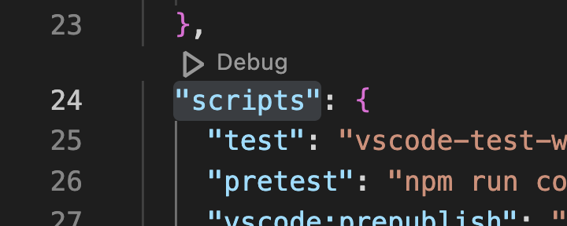
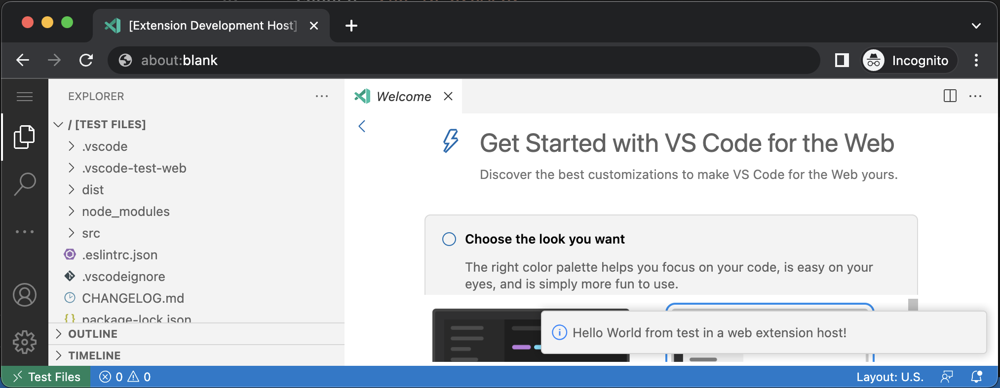

# VScode web-extension experiments
<!--
#vscode-web-extension, #typescript
-->

## Experiment 1, create an extension
<!--
#20230126@date, #node, #npm
-->

### Process

Environment setup
- Prerequisites: node 14 or above
    - on m1 mac tried 14
    - on arm win 11 tried 16
- `npm install -g yo generator-code`

Cookiecutter
- in terminal `yo code`
- choose `New Web Extension (TypeScript)`
- `Which package manager to use?` choose `npm`

Run example
- The example was already created in the previous step
    - I don't need to write/paste my own
- open folder in vscode
- install recommended extensions
- find file `package.json`
- find `"scripts"` section
- there should be a button
    - 
    - click on it
- choose `compile-web webpack`
    - skipping this step will cause error
- click on the button above again
- choose `run-in-browser`
- in the popup vscode-in-browser
    - ctrl-shift-p
    - type command `hello world`
    - enter
    - result: related info should show up in the bottom right corner
        - 

### Results
- [commit](https://github.com/urfdvw/vscode-ext-test/tree/12e14cb1d38333e58231ba3b4d5ceea89017393c)

### References

Readings
- [Your First Extension](https://code.visualstudio.com/api/extension-guides/web-extensions#test-your-web-extension)
- [Test your web extension](https://code.visualstudio.com/api/extension-guides/web-extensions#test-your-web-extension)

## Planned Experiment 2, Web Serial